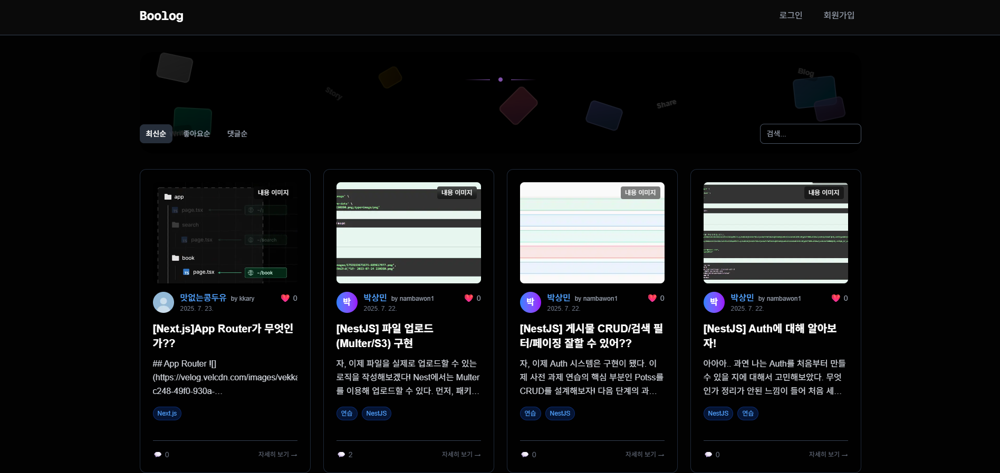
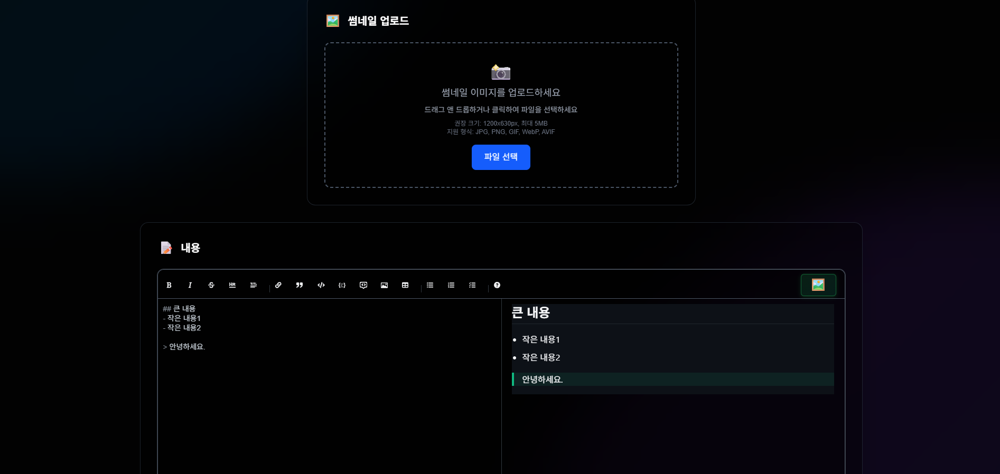
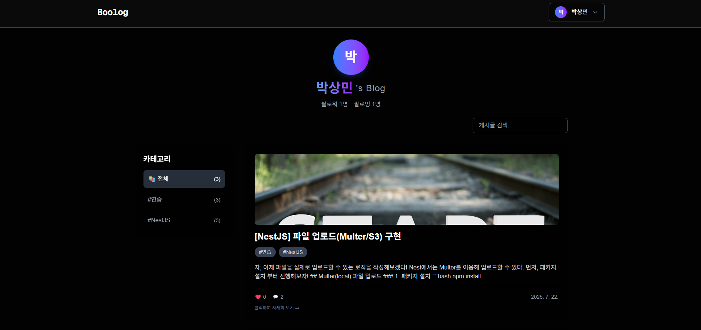
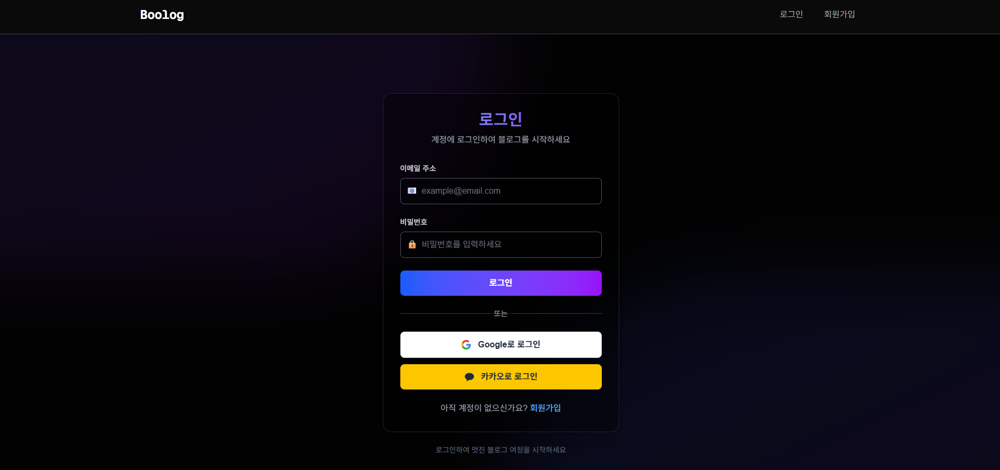
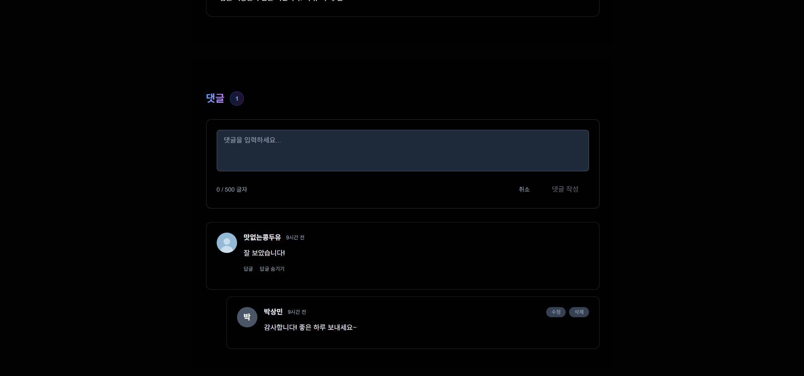
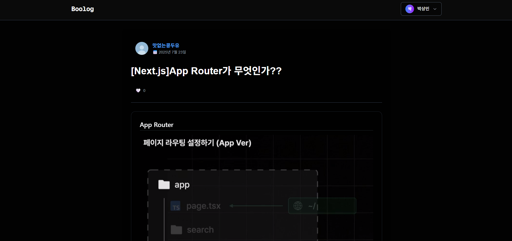
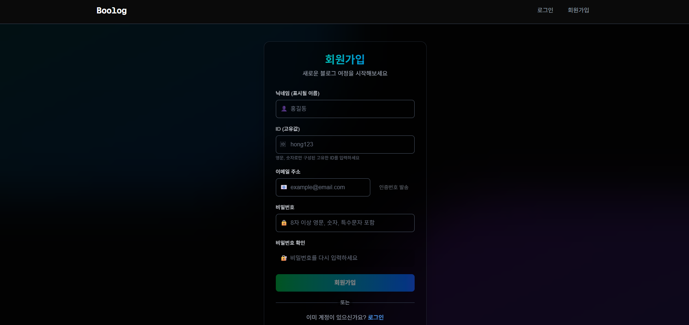

# Boolog

🌐 **[라이브 데모](https://boolog.vercel.app/)**

이 프로젝트는 개인적인 기록을 목적으로 시작되었습니다. 처음에는 소소한 기록 용도로 시작했지만, 점차 다른 사용자들도 함께 사용할 수 있는 블로그 플랫폼으로 발전시키고자 고도화하게 되었습니다. 마크다운으로 글을 작성하고, 이를 공유하며 소통할 수 있는 블로그 플랫폼 **Boolog**입니다.

## 프로젝트 스크린샷

<div align="center">

### 메인 페이지



</div>

|                               글 작성                                |                                 사용자 블로그                                  |                                로그인                                |
| :------------------------------------------------------------------: | :----------------------------------------------------------------------------: | :------------------------------------------------------------------: |
|  |  |  |

|                              댓글 시스템                              |                             게시글 상세보기                             |                                회원가입                                 |
| :-------------------------------------------------------------------: | :---------------------------------------------------------------------: | :---------------------------------------------------------------------: |
|  |  |  |

## 주요 기능

### 인증 시스템

- 일반 회원가입/로그인
- OAuth 소셜 로그인 (Google, Kakao)
- JWT 토큰 기반 인증 및 자동 갱신
- 로그인 상태 지속성 보장

### 블로그 핵심 기능

- 마크다운 에디터를 활용한 글 작성/수정
- 카테고리별 글 분류 및 필터링
- 실시간 댓글 시스템
- 사용자별 개인 블로그 페이지
- 무한 스크롤 방식의 글 목록
- 반응형 UI/UX

### 사용자 경험

- 로딩 상태를 위한 스켈레톤 UI
- 에러 핸들링 및 사용자 피드백
- 모바일 최적화 인터페이스

## 기술 스택

### Frontend

- **Next.js 15** - React 기반 풀스택 프레임워크
- **TypeScript** - 타입 안정성 보장
- **TailwindCSS** - 유틸리티 기반 스타일링
- **Zustand** - 경량 상태 관리
- **React Query** - 서버 상태 관리 및 캐싱
- **React Markdown** - 마크다운 렌더링

### 개발 도구

- **ESLint** - 코드 품질 관리
- **TypeScript** - 정적 타입 검사

## 프로젝트 구조

```
src/
├── app/                    # Next.js App Router 페이지들
│   ├── auth/              # 인증 관련 페이지
│   ├── posts/             # 블로그 게시글 페이지
│   ├── login/             # 로그인 페이지
│   ├── register/          # 회원가입 페이지
│   └── write/             # 글 작성 페이지
├── components/            # 재사용 가능한 컴포넌트들
│   ├── Comments/          # 댓글 시스템 컴포넌트
│   └── UserBlog/          # 사용자 블로그 컴포넌트
├── hooks/                 # 커스텀 React 훅들
├── lib/                   # API 통신 로직
├── stores/                # Zustand 상태 관리 스토어
└── types/                 # TypeScript 타입 정의
```

## 핵심 구현 사항

### 1. 인증 시스템 구현

```typescript
// JWT 토큰 자동 갱신 및 API 요청 래퍼
authenticatedFetch: async (url: string, options: RequestInit = {}) => {
  // Access Token 만료 시 자동으로 Refresh Token으로 갱신
  // 401 에러 처리 및 재요청 로직 구현
};
```

### 2. 무한 스크롤 구현

- React Query의 `useInfiniteQuery`를 활용한 효율적인 데이터 페칭
- 사용자 경험 최적화를 위한 스켈레톤 로딩

### 3. 상태 관리 아키텍처

- Zustand를 통한 전역 상태 관리 (인증 상태, 사용자 정보)
- React Query를 통한 서버 상태 캐싱 및 동기화
- localStorage 연동을 통한 상태 지속성

### 4. TypeScript 활용

- 엄격한 타입 정의로 런타임 에러 방지
- API 응답 데이터 타입 안정성 보장
- 컴포넌트 Props 타입 정의

## API 연동

백엔드 API와의 RESTful 통신을 통해 다음 기능들을 구현했습니다:

- **인증**: `/auth/login`, `/auth/signup`, `/auth/refresh`
- **OAuth**: `/auth/google`, `/auth/kakao`
- **게시글**: `/posts` (CRUD)
- **댓글**: `/comments` (CRUD)
- **사용자**: `/users` (프로필 조회)

## 주요 학습 포인트

- Next.js App Router를 활용한 모던 React 애플리케이션 개발
- JWT 토큰 기반 인증 시스템 구현 및 보안 고려사항
- React Query를 활용한 효율적인 서버 상태 관리
- TypeScript를 활용한 대규모 프로젝트의 타입 안정성 확보
- 사용자 경험을 고려한 반응형 웹 디자인 구현

## 향후 개선사항

- 실시간 알림 시스템 (WebSocket)
